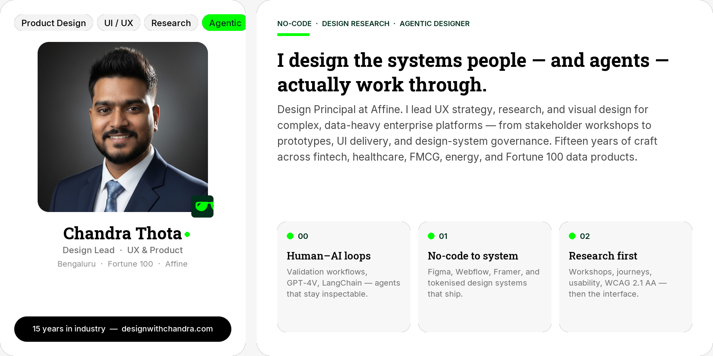
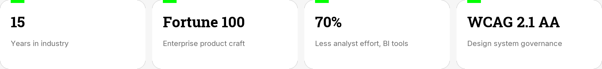
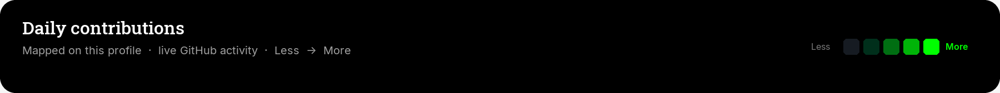
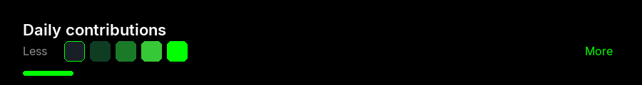
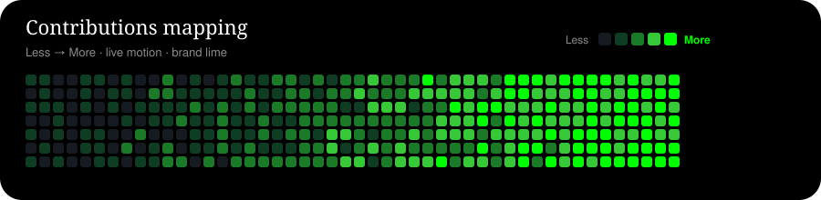
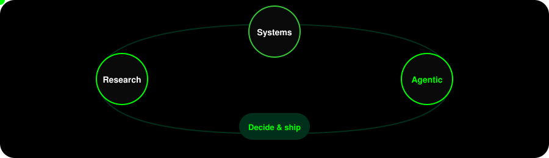
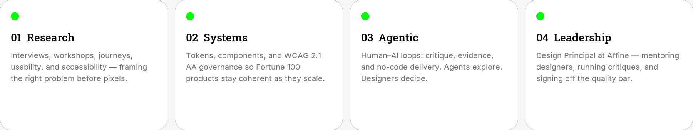
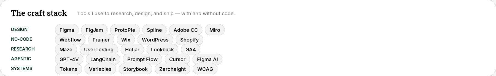
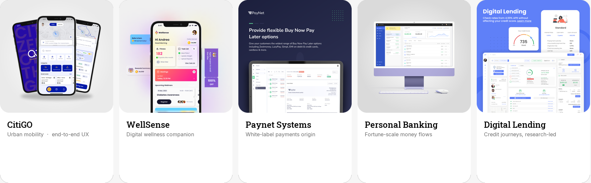
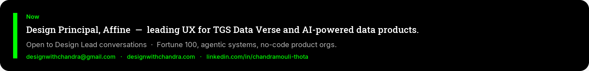

  
   
  
   
  

  <a href="https://designwithchandra.com">Portfolio</a>
  ·
  <a href="https://www.linkedin.com/in/chandramouli-thota">LinkedIn</a>
  ·
  <a href="mailto:designwithchandra@gmail.com">Email</a>
  ·
  <a href="https://designwithchandra.com/wp-content/uploads/2025/05/Chandra-Resume.pdf">Resume</a>

  
  
  
  

  

 

  

---

  
   
  
   
  
   
  

<b>Open live contribution graphs</b> — activity, streak, and stats

 

  
   
  
  

**Recent activity**

<!--START_SECTION:activity-->
- Profile is live — new activity maps here as it happens.
<!--END_SECTION:activity-->

---

  

<b>How I work</b> — research, systems, agentic design, leadership

 

  
  

---

### Selected work

<b>Open case studies</b> — click a project, or fold this panel shut

 

  

| Project | What I designed | Open |
| --- | --- | --- |
| **CitiGO** | Urban mobility, end-to-end UX | [Case study](https://designwithchandra.com) |
| **WellSense** | Digital wellness companion | [Case study](https://designwithchandra.com) |
| **Paynet Systems** | White-label payments origin | [Case study](https://designwithchandra.com) |
| **Personal Banking** | Fortune-scale money flows | [Protected](https://designwithchandra.com) |
| **Digital Lending** | Credit journeys, research-led | [Case study](https://designwithchandra.com) |
| **TGS Data Verse / DuPont** | Enterprise data products + design system | NDA |

---

<b>Brands</b> — Fortune 100 and global product teams

 

`Microsoft` `Verizon` `Expedia` `Kraft Heinz` `DuPont` `Unilever` `Cargill` `HSBC` `WellSense` `Paynet`

  

