

  <picture>
    <source media="(prefers-color-scheme: dark)" srcset="assets/dark/banner.png" />
    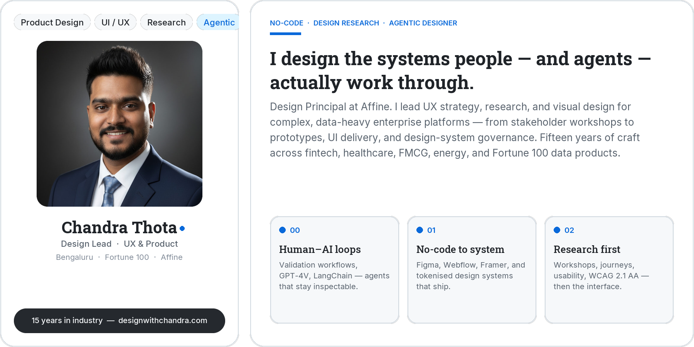
  </picture>
   
  <picture>
    <source media="(prefers-color-scheme: dark)" srcset="https://readme-typing-svg.demolab.com?font=Roboto+Slab&weight=700&size=26&duration=2800&pause=700&color=4493F8&background=00000000&center=true&vCenter=true&width=880&height=44&lines=Design+Lead+%C2%B7+Agentic+Designer;15+years+of+UI%2FUX%2C+research+%26+no-code;Fortune+100+product+systems;Agents+explore.+Designers+decide." />
    
  </picture>
   
  <picture>
    <source media="(prefers-color-scheme: dark)" srcset="assets/dark/motion/roles.svg" />
    
  </picture>

  <a href="https://designwithchandra.com">Portfolio</a>
  ·
  <a href="https://www.linkedin.com/in/chandramouli-thota">LinkedIn</a>
  ·
  <a href="mailto:designwithchandra@gmail.com">Email</a>
  ·
  <a href="https://designwithchandra.com/wp-content/uploads/2025/05/Chandra-Resume.pdf">Resume</a>

  
  
  
  

  <picture>
    <source media="(prefers-color-scheme: dark)" srcset="assets/dark/motion/marquee.svg" />
    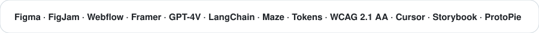
  </picture>

 

  <picture>
    <source media="(prefers-color-scheme: dark)" srcset="assets/dark/metrics.png" />
    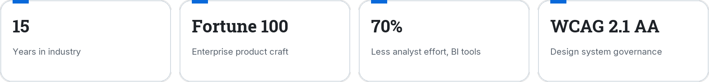
  </picture>

---

  <picture>
    <source media="(prefers-color-scheme: dark)" srcset="assets/dark/contrib-header.png" />
    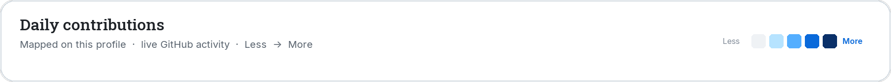
  </picture>
   
  <picture>
    <source media="(prefers-color-scheme: dark)" srcset="assets/dark/motion/contrib-pulse.gif" />
    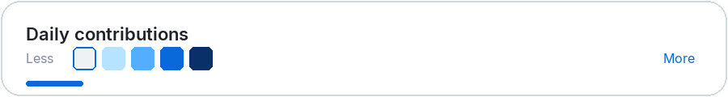
  </picture>
   
  <picture>
    <source media="(prefers-color-scheme: dark)" srcset="assets/dark/motion/contrib-flow.svg" />
    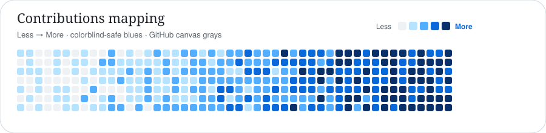
  </picture>
   
  <picture>
    <source media="(prefers-color-scheme: dark)" srcset="https://ghchart.rshah.org/4493f8/designwithchandra" />
    
  </picture>

<b>Open live contribution graphs</b> — activity, streak, and stats

 

  <picture>
    <source media="(prefers-color-scheme: dark)" srcset="https://github-readme-activity-graph.vercel.app/graph?username=designwithchandra&custom_title=Daily%20contributions&bg_color=0d1117&color=9198a1&line=4493f8&point=58a6ff&area=true&area_color=0c2d6b&hide_border=true&radius=16&height=300" />
    
  </picture>
   
  <picture>
    <source media="(prefers-color-scheme: dark)" srcset="https://streak-stats.demolab.com?user=designwithchandra&background=0D1117&border=3D444D&stroke=3D444D&ring=4493F8&fire=4493F8&currStreakNum=F0F6FC&sideNums=4493F8&currStreakLabel=4493F8&sideLabels=9198A1&dates=9198A1&hide_border=true&card_width=450" />
    
  </picture>
  <picture>
    <source media="(prefers-color-scheme: dark)" srcset="https://github-readme-stats.vercel.app/api?username=designwithchandra&show_icons=true&include_all_commits=true&count_private=true&hide_border=true&bg_color=0d1117&title_color=4493f8&icon_color=4493f8&text_color=f0f6fc&ring_color=4493f8" />
    
  </picture>

**Recent activity**

<!--START_SECTION:activity-->
- Profile is live — new activity maps here as it happens.
<!--END_SECTION:activity-->

---

  <picture>
    <source media="(prefers-color-scheme: dark)" srcset="assets/dark/motion/orbit.svg" />
    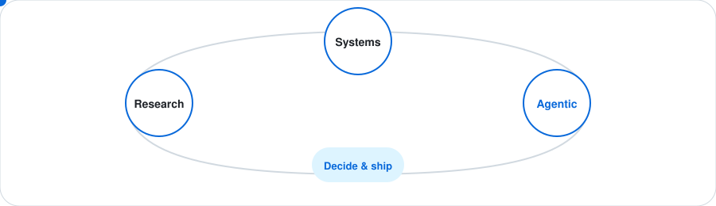
  </picture>

<b>How I work</b> — research, systems, agentic design, leadership

 

  <picture>
    <source media="(prefers-color-scheme: dark)" srcset="assets/dark/practice.png" />
    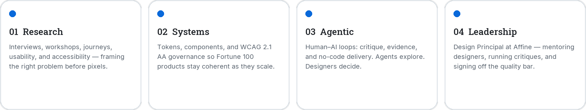
  </picture>
  <picture>
    <source media="(prefers-color-scheme: dark)" srcset="assets/dark/stack.png" />
    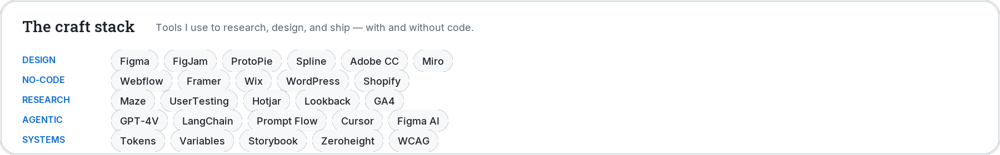
  </picture>

---

### Selected work

<b>Open case studies</b> — click a project, or fold this panel shut

 

  <a href="https://designwithchandra.com">
    <picture>
      <source media="(prefers-color-scheme: dark)" srcset="assets/dark/work.png" />
      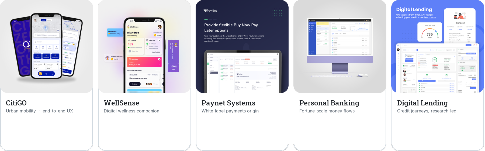
    </picture>
  </a>

| Project | What I designed | Open |
| --- | --- | --- |
| **CitiGO** | Urban mobility, end-to-end UX | [Case study](https://designwithchandra.com) |
| **WellSense** | Digital wellness companion | [Case study](https://designwithchandra.com) |
| **Paynet Systems** | White-label payments origin | [Case study](https://designwithchandra.com) |
| **Personal Banking** | Fortune-scale money flows | [Protected](https://designwithchandra.com) |
| **Digital Lending** | Credit journeys, research-led | [Case study](https://designwithchandra.com) |
| **TGS Data Verse / DuPont** | Enterprise data products + design system | NDA |

---

<b>Brands</b> — Fortune 100 and global product teams

 

`Microsoft` `Verizon` `Expedia` `Kraft Heinz` `DuPont` `Unilever` `Cargill` `HSBC` `WellSense` `Paynet`

  <picture>
    <source media="(prefers-color-scheme: dark)" srcset="assets/dark/now.png" />
    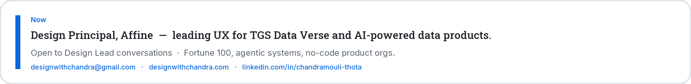
  </picture>

